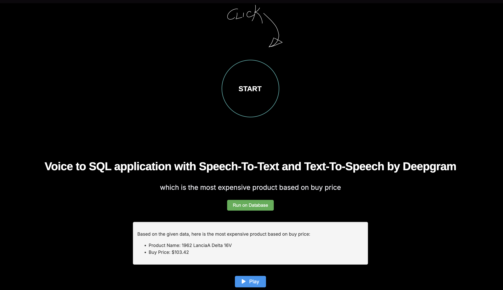
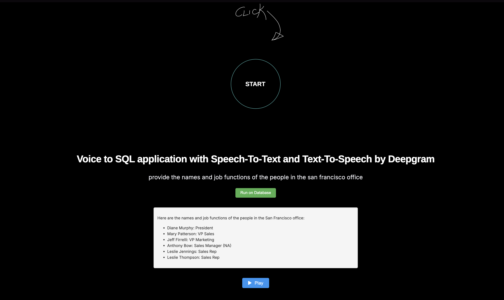

# Enhanced Natural Language to SQL implementation using Deepgram

This project is a real-time web application that:
- Transcribes live speech from your microphone using Deepgram’s API.
- Displays the transcription in the browser.
- Lets you run the transcribed text as a natural language query on a MySQL database using an LLM-powered NL-to-SQL chain.
- Optionally, converts query results to speech (TTS) and plays them back in the browser.


## Sign-up to Deepgram and OpenAI and Get API key

Before you start, it's essential to generate a Deepgram API and OpenAI key to use in this project. [DeepGram API key](https://console.deepgram.com/signup?jump=keys) and [OpenAI API Key](https://platform.openai.com).

## Features
- *Live Speech Transcription*: Speak into your mic and see captions appear instantly.
- *Natural Language to SQL*: Ask questions in plain English and get answers from your database.
- *Text-to-Speech (TTS)*: Play back the query result as audio.
- *Modern UI*: Clean, interactive web interface, based in the Flask live transcription app provided by Deepgram

## Prerequisites
- Python 3.8+
- MySQL server (with the classicmodels database or your own)
- Deepgram API key
- OpenAI API key (for NL-to-SQL)
- ffmpeg and portaudio (for audio features)

## Quickstart

### Manual

Follow these steps to get started with this starter application.

#### Clone the repository

Go to GitHub and [clone the repository](https://github.com/avnishkanungo/NLToSQLEnhanced.git).

#### Install dependencies

Install the project dependencies in your environment.

```bash
pip install -r requirements.txt
```

#### Edit the config file

Create a .env file in the project root with the following content:

```bash
DEEPGRAM_API_KEY=your_deepgram_api_key
OPENAI_API_KEY=your_openai_api_key
```

#### Setup the Database

- Make sure you have a local instance of MySQL installed and running.
- Import the classicmodels database(the one that I am using, please refer [here](https://www.mysqltutorial.org/getting-started-with-mysql/mysql-sample-database/)) or use your own.
- Update database credentials in the code or .env if needed as per your implementation

#### Run the application

Best way to run this is to open 3 terminal windows/tabs and run the steps below:

##### Terminal 1:

```bash
python app.py
```
Runs the UI module, on port 8000.


##### Terminal 2:

```bash
python app_socketio.py
```
Runs the backend for live SST using Deepgram and natural language to SQL implementation, to get the insights on port 5001.

##### Termainal 3:
```bash
python tts_socketio.py
```
Runs the backend for TTS using Deepgram to convert the insights received and play it in the browser, on the port 5002.

## Usage

- Click the START button to begin live transcription.
- Speak into your microphone; captions will appear in real time.
- Click Run on Database to send the transcription as a query to the database.
- View the result below, and click Play to hear the result as audio.




## Basic Troubleshooting

- If you see ERR_CONNECTION_REFUSED, make sure all servers are running.
- If audio does not play, ensure your browser has microphone permissions and your system has ffmpeg and portaudio installed.
- Check your .env file for correct API keys.

## References

This code UI was implemented using the Live Transcription app made available by DeepGram [here](https://github.com/deepgram-starters/flask-live-transcription)

